# WebScraping-Sephora
Quantiative approach to finding perfect shades of lipsticks for everyone.


## Table of Contents
[Directory Structure](#Directory-Structure)<br>
[Project Description](#Project-Description)<br>
[Data Description](#Data-Description)<br>
-[Source](#Source)<br>
[Data Visualization](#Data-Visualization)<br>
[Conclusion](#Conclusion)<br>


## Directory Structure
```
.
├── WebScraping-Sephora
    ├── 01_Sephora_getProductURLs.ipynb
    ├── 02_Sephora_getReviews.ipynb
    ├── 03_Sephora_EDA.ipynb
    ├── 04_Sephora_Stats.ipynb
    ├── data
        ├── product_urls.csv
        ├── product_info0.csv
        ├── ...
        ├── product_info462.csv
    ├── plots
        ├── 
    ├── README.md
```


## Project Description
When choosing color makeups such as lipsticks, natural colors that individuals possess such as skin tone, hair color, and eye color contribute. In some cases, hair and eye colors characterize an individual's dominant color templates due to genentics. For instance, people with suppressed melanin production express blue eyes and blonde hair with relatively fair skin. However, in some cases where hair and eye colors are different spectrums of brown due to increased melanin production, skin "undertone" may contribute more in determining the dominant "wearable" colors. While some attention is given to the lightness/darkness of the skin tone as Sephora provides skintone category input option (9 levels from porcelain to ebony) to the reviewers, it is upto the customer to determine which hue (ie. "yellow", "pink", or "olive" undertone) the best matching shade of the foundation has. It becomes even more complicated when choosing lip or eye color makeups because there are no two pink lipsticks that are the same! Wouldn't it be wonderful if you can determine which shade of foundation (depending on the brand) is the best fit as well as whether this particular color of lipstick would look good on you or not based on your purchase and review history?

As the first step, the goal of this project is to explore the color spectrum of the foundations and lipsticks given reviewer's dominant colors (self-reported hair color, eye color, and skin tone from Sephora's reviewer inputs) to see if particular features are strongly correlated between the purchased and liked foundation and lipstick colors.

Since sephora.com runs heavily on dynamic API components, product URLs were first collected from Sephora using Selenium instead of Scrapy. Then product information needed to pull review JSON from Bazaarvoice were collected from the product page using selenium. Then RBG values were extracted from color swatches provided in the reviews. Then linear models were explored to find out which self-reported colors are relevant, and if any relationships between favored foundation and lipstick shades arise.

Assumptions made in the analysis:
(1) Ratings of 4 and 5 indicated that the reviewers liked the shades as well as other qualities of the product.
(2) Although only the reviews with color swatches were selected, this selection process randomly sampled from the whole review data.
(3) Swatches represent the true color, and its averaged RGB represents the whole image.


## Data Description
name of the column|description|break down|
|---|---|---|
|Product|the name of the product as listed||
|Category|category the product|foundation-makeup, lipstick||
|URL|the original URL gathered with selenium||
|Price|the price listed in dollars||
|UserName|nickname of the reviewer||
|UserID|author ID number of the reviewer||
|Rating|number of stars|4, 5||
|Eyecolor|eyecolor of the reviewer|blue, brown, green, gray, hazel||
|Haircolor|haircolor of the reviewer|blonde, brunette, auburn, black, red, gray||
|Skintone|skintone of the reviewer|porcelain, fair, light, medium, tan, olive, deep, dark, ebony||
|SwatchID|swatch ID number of the product||
|R|red scalar from the swatch's RGB|0~255||
|G|green scalar from the swatch's RGB|0~255||
|B|blue scalar from the swatch's RGB|0~255||

Total number of scraped data with Ratings of 4 or 5: 176958<br>
Total number of unique author IDs: 127859<br>
Total number of unique reviewer Nicknames: 125759<br>
Total number of unique foundation products: 191<br>
Total number of unique lipcolor products: 230<br>
Total number of unique foundation shades: 3689<br>
Total number of unique lipcolor shades: 3083<br>


### Source
Product data were gathered from [Sephora](https://www.sephora.com/)<br>
Product review data were gathered from [Bazaarvoice](https://api.bazaarvoice.com)<br>


## Data Visualization
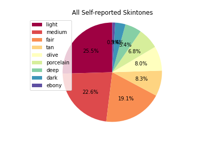
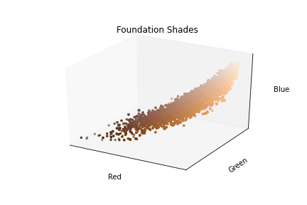
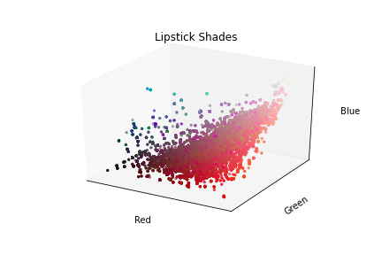
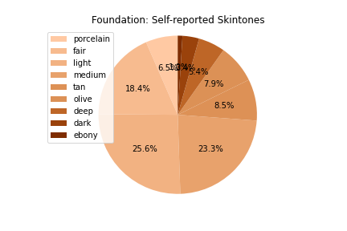
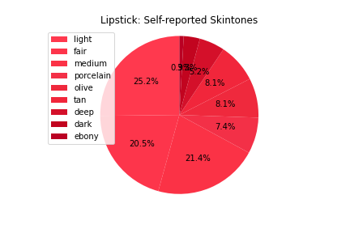
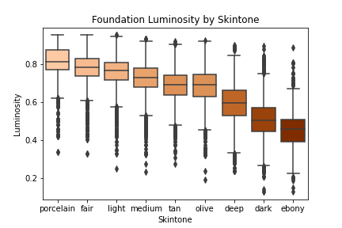
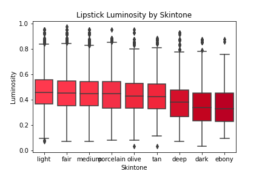
Foundation RBG by Skintone<br>
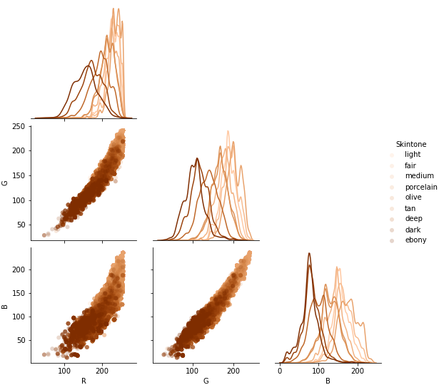
Lipstick RGB by Skintone<br>
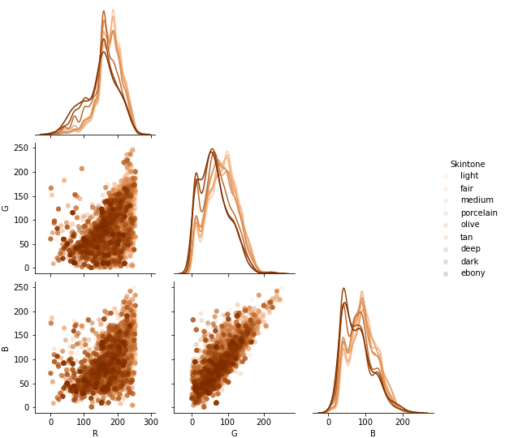
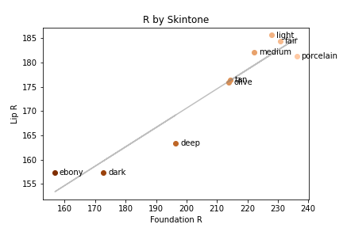
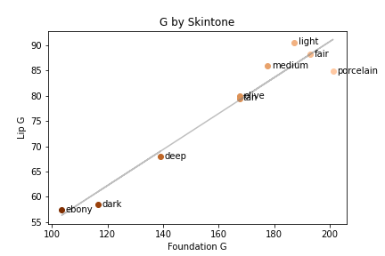
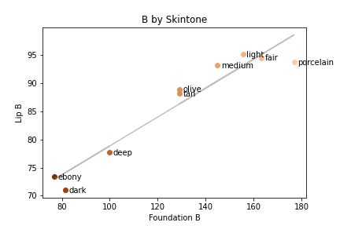


## Conclusion
To my surprise, there are more foundation shades than lipstick shades!

As for the rewiwer's distribution, people with darker skintones (ebony, dark, and deep) make up less than 10% (9.7% to be exact) of the sampled reviewers regardless of foundation and lipstick product categories, indicating potential expansion of customers.

Exploratory data analysis suggests that self-reported skintone shows monotonic relationship with the foundation luminosity and lipstick luminosity. For foundation makeup, RGB color distribution showed distinct patterns for each of the self-reported skintones except for tan and olive, which were indistinguishable. In terms of lipstick RGB color distribution, skintones can be divided into two groups (Group 1: ebony, dark, deep; Group 2: porcelain, fair, light, medium, tan, olive). Group 1 purchased red shifted colors with less blue and green colors, while Group 2 purchased more lighter and neutral (stronger green and blue components) colors.
However, self-reported haircolor and eyeclor do not show significant relationship with foundation color spectrum or luminosity.

Pairplots of R, G, B by each self-reporting categories (skintone, haircolor, eyecolor) showed that there are systematic shifts in RGB distribution depending on skintone, which becomes less visible when grouped by haircolor and eyecolor. Because paired data was not available due to the lack of overlapping reviewer name between foundation and lipstick categories, linear models were developed using aggregates grouped by self-reported skintone, haircolor, or eyecolor. Linear models between each of medians of R, G, and B values of foundation and lipstick grouped by skintone showed strong correlations (R2 = 0.898, 0.929, 0.912, for R, G, B, respectively) that were significant (P < 0.0001). For haircolor, the linear model for R values showed positive relationship with a strong correlation (R2 = 0.614, P = 0.0402) but the model did not survive bonferroni correction. For eyecolor, the linear models for B and G values showed positive relationships with strong correlations (R2 = 0.713, 0.656 for G and B, respectively) but the models did not achieve statistical significance (P = 0.456 and 0.0607 for G and B, respectively) after bonferroni correction. 

From the models, it can be concluded that on average, the lipstick shade that doesn't collide with the foundation shade can be described as following:
Lipstick{R,G,B|r,g,b} = Foundation{91+0.40r,19+0.36g,53+0.26b}

In addition, contrary to the general belief that categorized eyecolor and haircolor help finding matching lipstick shades, on average these two color features did not have any predictive power on the purchased and liked lipstick shades. These results may help in formatting reviewer's responses to provide better information to the new customers or generating suggestions for the future purchases. 

Future directions include running paired analysis (i.e. pair lip and foundation colors) and look at the similarity between those two colors and people's preferences in relation to such index.

